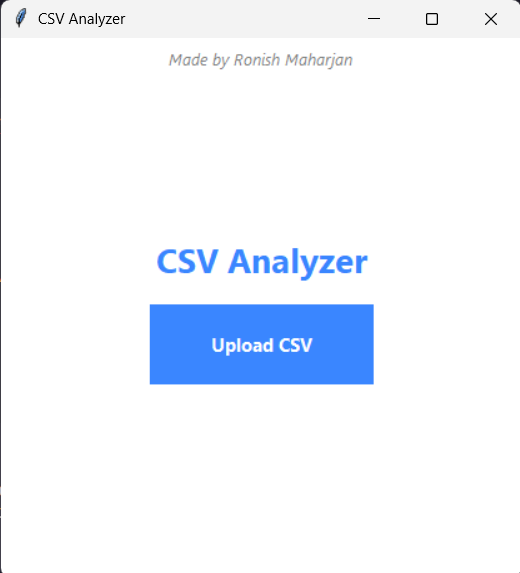
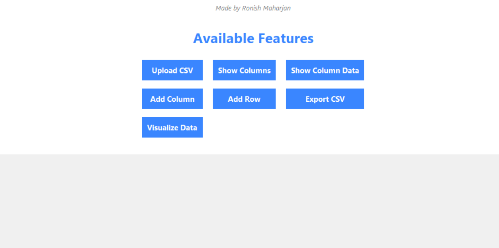
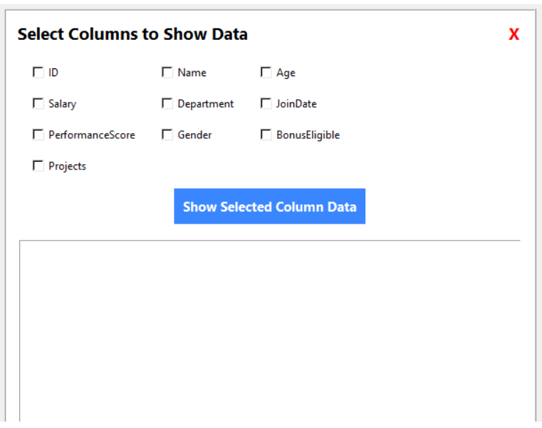
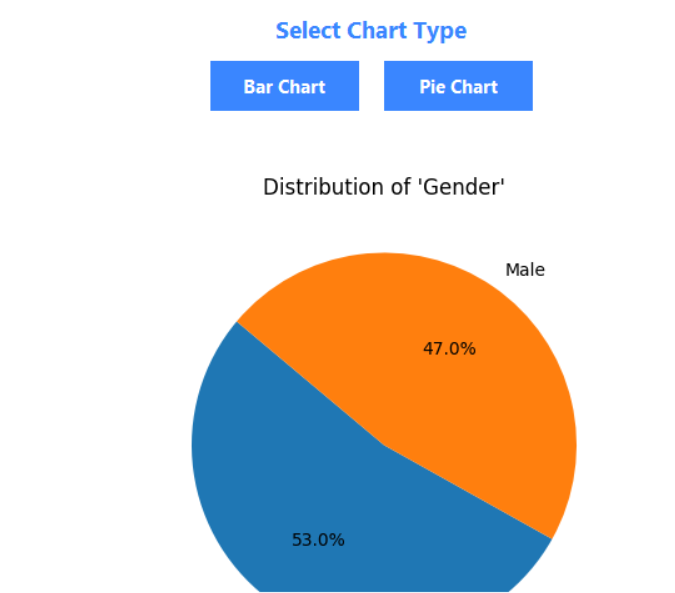

# CSV Analyzer

Its a **`Python`** project used to analyze the csv datas along with visual representation like **`Pichart`**, **`BarGraph`**.

---

## Libraries Used

- **Python 3.x**
- **Tkinter** (for GUI)
- **Pandas** (for CSV data handling)
- **Matplotlib** (for data visualization)

---

## Features

- Upload CSV files and load data easily.
- View all available columns in the CSV.
- Select columns and view their data in a readable format.
- Add new columns with default values.
- Add new rows by selecting columns and providing data.
- Export the updated CSV file.
- Visualize data using Bar and Pie charts with selectable columns.

---

## Installation

1. **Clone this repository:**

   ```bash
   git clone git@github.com:maharjanronish/csv_analyzer.git

   cd csv-analyzer
   ```

2. **Run Below Code**

   ```bash
   pip install -r requirements.txt

   ```

---

## ScreenShots Of the CSV Analyzer

1. 

2. 

3. 

4. 
